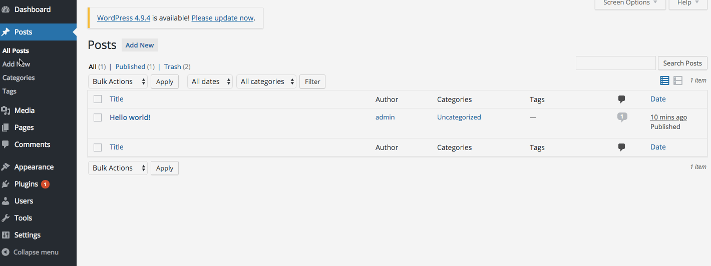
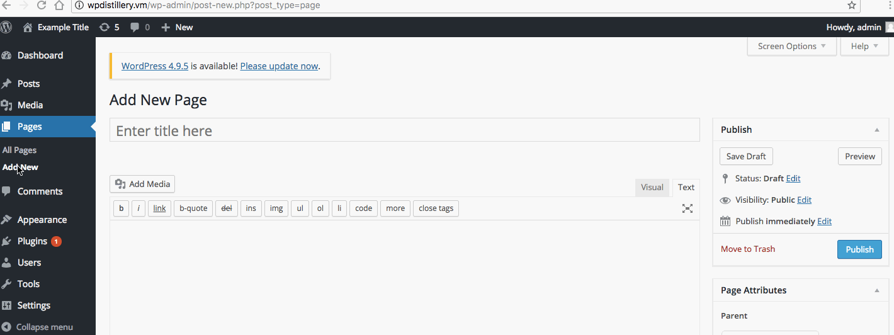

# Week-7-assignment
Time spent: 7.5 hours spent in total

1.
Vulnerability type: XSS 
Tested in version: 4.2
Fixed in vertion: 4.6.1

This vulnerability allows users with special privileges(ex: author,aditor) to run XSS on a WordPress. The action can be done by incorporating cross site scripting inside a post. If user with higher privileges(ex: admin) viewed the page the XSS would be executed.

2.
Vulnerability type: User Enumeration 
Tested in version: 4.2
Fixed in vertion: 

This vulnerability allows to find out user names list. As a result this can be used in a brute forth atack in order to gain or modify private data.

3.
Vulnerability type: XSS

Tested in version: 4.2

This vulnerability is based on the discovery that meta information (ID3) stored in audio files are
not properly sanitized in case they are uploaded by a privilage user(ex: editor or admin). If this kind of user viewed the page the XSS would be executed.

